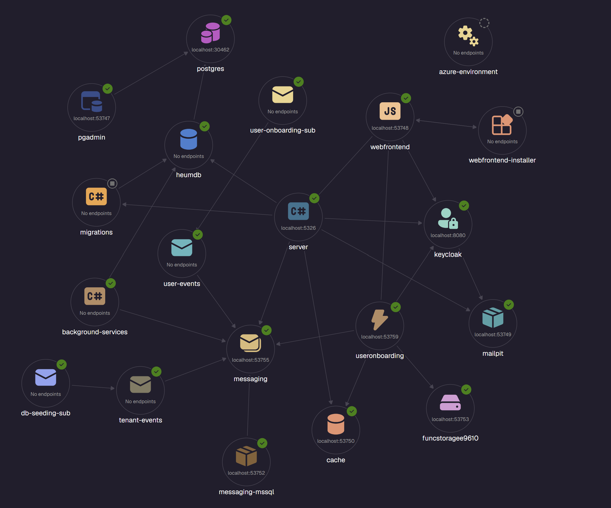

# Heum

Heum is a multi-tenant SaaS platform with a .NET backend and a React frontend. Tenants are isolated at the data layer; users authenticate via Keycloak with role-based access control (system admins vs. tenant admins).

## Architecture



The diagram shows the full set of services orchestrated by .NET Aspire locally: the API **server** at the centre, backed by **heumdb** (Postgres), **cache** (Redis), and **keycloak**; async messaging flows through the **messaging** Service Bus emulator via **user-events** and **tenant-events** topics/subscriptions; the **useronboarding** Azure Function consumes those events and sends mail via **mailpit**; **background-services** drives the outbox; and the React **webfrontend** is served alongside everything else.

## Tech Stack

### Backend

| Technology | Purpose |
|---|---|
| .NET 10 | Runtime |
| ASP.NET Core Minimal APIs | HTTP endpoints |
| .NET Aspire | Local orchestration — wires Postgres, Redis, Keycloak, MailPit, Service Bus emulator, and all services |
| Entity Framework Core | ORM + migrations; global query filters enforce tenant isolation and soft-delete |
| PostgreSQL | Primary database |
| Redis | Caching |
| Keycloak | OIDC identity provider; realm roles drive authorization policies |
| Azure Service Bus | Async event messaging |
| Azure Functions v4 | Event consumers (e.g. user onboarding emails) |
| MailPit | Local SMTP / email preview |

### Frontend

| Technology | Purpose |
|---|---|
| React 19 | UI framework |
| TypeScript | Type safety |
| Vite | Dev server and bundler |
| MUI (Material UI) v9 | Component library |
| TanStack Query | Server state and data fetching |
| Axios | HTTP client |
| react-router-dom v7 | Client-side routing |
| react-oidc-context | OIDC session management |
| notistack | Snackbar notifications |

### Testing

| Technology | Purpose |
|---|---|
| xUnit v3 | Test framework |
| WebApplicationFactory | Integration test host |
| EF InMemory / Testcontainers | DB backend for tests (real Postgres in CI) |

## Getting Started

### Prerequisites

- .NET 10 SDK
- .NET Aspire workload: `dotnet workload install aspire`
- Node.js 20+
- Docker (for Aspire to spin up infrastructure containers)
- Azure Functions Core Tools v4: `npm install -g azure-functions-core-tools@4`

### First-time setup

The Keycloak admin client secret must be provided as a user secret on the AppHost before the first run, or startup will fail with a missing configuration error:

```bash
dotnet user-secrets --project src/Heum.AppHost set KeycloakAdminSecret <your-secret>
```

The value must match `client_secret` for the `dotnet-admin-api` client in the Keycloak realm export at `src/Heum.AppHost/Keycloak/realm-export.json`.

### Run the full stack

```bash
dotnet restore
dotnet run --project src/Heum.AppHost
```

Aspire starts Postgres, Redis, Keycloak, MailPit, the Service Bus emulator, the API server, and the frontend dev server automatically.

### Seeded credentials

The Keycloak realm import seeds three users for local development:

| User | Password | Role |
|---|---|---|
| `admin@heum.dev` | `admin123` | Tenant Admin |
| `user@heum.dev` | `user123` | Tenant User |
| `sysadmin@heum.dev` | `sysadmin123` | System Admin |

Email is captured by MailPit — browse to the MailPit dashboard (shown in the Aspire dashboard) to inspect sent messages.

### Run the frontend standalone

```bash
cd src/frontend
npm install
npm run dev
```

### Run tests

```bash
dotnet test
```

Set `USE_TESTCONTAINERS=true` to run integration tests against a real PostgreSQL container instead of EF InMemory.

### Adding EF migrations

```bash
dotnet ef migrations add <MigrationName> \
  --project src/Heum.Data \
  --startup-project src/Heum.MigrationService
```

## Renaming the project

To rename "Heum" to your own product name, run one of the provided scripts from the repo root:

```powershell
# PowerShell (Windows)
.\rename.ps1 -NewName YourName
```

```bash
# Bash (Linux/macOS)
./rename.sh YourName
```

The script rewrites file contents and renames files/directories (skipping `obj`, `bin`, `node_modules`, and `.git`). Review the diff with `git diff --stat` before committing.

## Production environment variables

| Variable | Where set | Purpose |
|---|---|---|
| `KeycloakAdmin__Realm` | App config / env | Keycloak realm name (default: `saas-app`) |
| `KeycloakAdmin__ClientId` | App config / env | Admin API client id (default: `dotnet-admin-api`) |
| `KeycloakAdmin__ClientSecret` | Secret / env | Admin API client secret — **required** |
| `KeycloakAdmin__BaseUrl` | Injected by Aspire | Keycloak base URL |
| `ConnectionStrings__heumdb` | Injected by Aspire | Postgres connection string |
| `ConnectionStrings__cache` | Injected by Aspire | Redis connection string |
| `ConnectionStrings__messaging` | Injected by Aspire | Service Bus connection string |
| `ConnectionStrings__blobs` | Injected by Aspire | Blob storage connection string |
| `RateLimiting__Global__*` | App config / env | Global rate limit parameters |
| `RateLimiting__Tenant__*` | App config / env | Per-tenant rate limit parameters |
| `Smtp__Host` / `Smtp__Port` | Injected by Aspire | SMTP server for Functions project |

> Note: the Dockerfile comment references `Keycloak__*`; the code reads `KeycloakAdmin__*`. Use `KeycloakAdmin__*` in production.
